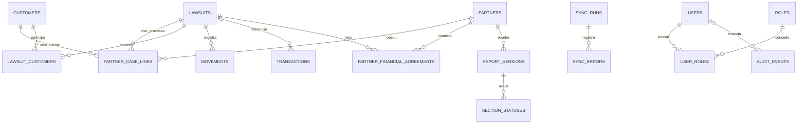

# Modelo de dados e contratos internos

**Versão:** 1.0  
**Data:** 15/09/2026  
**Banco-alvo:** PostgreSQL 17 ou compatível, externo à Vercel em produção

## Princípios

- UUIDs internos desacoplam o domínio dos identificadores do Advbox.
- IDs externos confirmados usam restrições de unicidade; número processual é opcional e não é chave.
- Instantes usam `TIMESTAMPTZ`; datas civis de competência, processo e vigência usam `DATE`.
- Dinheiro usa `NUMERIC(18,2)` e contratos Python com `Decimal`; `float` é rejeitado.
- Percentuais usam `NUMERIC(7,4)`.
- Ausente, zero, não aplicável, pendente e restrito são estados diferentes.
- Remoções relevantes usam status e `deleted_at`, preservando histórico e auditoria.
- Nenhum payload bruto da API é armazenado. O modelo contém apenas campos normalizados confirmados.
- PDFs permanecem fora do banco; `report_versions` guarda somente chave do objeto e hash.

## Diagrama



## Dicionário de dados

### Entidades de carteira

| Tabela | Campos principais | Integridade e semântica |
|---|---|---|
| `partners` | `id`, `external_id`, `name`, `status`, `deleted_at`, timestamps | `external_id` único é a chave técnica do parceiro; `name` é somente exibição |
| `customers` | `id`, `advbox_id`, `name`, `identification`, `origin`, `source_created_at`, `synced_at`, `status`, `deleted_at` | `advbox_id` único; campos pessoais são opcionais e restritos |
| `lawsuits` | `id`, `advbox_id`, `process_number`, `protocol_number`, `folder`, IDs de grupo/tipo/etapa/responsável, `process_date`, timestamps, status | `advbox_id` único; números processual e de protocolo são opcionais e não únicos |
| `lawsuit_customers` | `id`, `lawsuit_id`, `customer_id`, timestamps | FKs e unicidade do par evitam repetição da relação |
| `movements` | `id`, `lawsuit_id`, `source_fingerprint`, `occurred_at`, `title`, `synced_at`, timestamps | A API não expôs ID de movimento; fingerprint determinístico por processo garante idempotência |
| `transactions` | `id`, `advbox_id`, `lawsuit_id`, `amount`, `amount_status`, classificação financeira e datas | Endpoint confirmado; `advbox_id` único; valor só existe quando status é `available` |

### Vínculo, financeiro e relatório

| Tabela | Campos principais | Integridade e semântica |
|---|---|---|
| `partner_case_links` | `partner_id`, tipo/ID externo da entidade, FK de cliente ou processo, vigência, fonte, status e auditoria | Tipo deve corresponder a exatamente uma FK; datas válidas; constraint de exclusão impede vigências ativas sobrepostas para a mesma entidade |
| `partner_financial_agreements` | parceiro, processo, tipo de receita, percentual, dedução fixa/percentual, arredondamento, vigência, status e auditoria | Percentuais entre 0 e 100, dedução fixa não negativa, escala 0–4 e combinação inicial única |
| `report_versions` | parceiro, período, versão, status, datas, chave do objeto e SHA-256 | Versão única por parceiro/período; período válido; arquivo não reside no banco |
| `section_statuses` | versão, seção, `availability_status`, motivo e instante de avaliação | Uma linha por seção/versão; ausência nunca é convertida em zero |

O contrato lógico do ADR-001 contém `partner_external_id` e `partner_name`. No modelo normalizado, ambos são obtidos por `partner_case_links.partner_id → partners`; não são duplicados na tabela de vínculo.

### Operação, identidade e auditoria

| Tabela | Campos principais | Integridade e semântica |
|---|---|---|
| `sync_runs` | chave de idempotência, recurso, status, início/fim, próximo offset e contagens | Chave de idempotência única; checkpoint é escalar, não payload bruto |
| `sync_errors` | execução, instante, recurso, código, HTTP, retentativa e hash de referência | Não guarda corpo da resposta, mensagem livre nem ID externo em claro |
| `users` | subject externo, nome de exibição opcional, status e último login | Não armazena senha; subject do provedor de identidade é único |
| `roles` | chave e descrição | Chave única e catálogo mínimo |
| `user_roles` | usuário e papel | Par único com remoção em cascata |
| `audit_events` | ator, ação, tipo/ID interno, correlação, nomes de campos alterados e motivo | Registra nomes de campos, nunca valores anteriores/posteriores ou payload livre |

## Estados explícitos

`available`, `not_provided`, `not_applicable`, `pending_validation` e `restricted` são usados por valores e seções. Para dinheiro:

- `available` exige `amount`, inclusive `Decimal("0.00")`;
- qualquer outro estado exige `amount = NULL`;
- zero representa zero confirmado, jamais dado ausente.

## Classificação de sensibilidade

| Classe | Tabelas/campos | Controle esperado |
|---|---|---|
| Interno | roles, estados, contagens de sync, reason codes | Acesso operacional autenticado |
| Confidencial | partners, links, report metadata, users, audit events | Menor privilégio, trilha de auditoria e exportação controlada |
| Restrito | customers, lawsuits, movements, transactions, acordos financeiros | Criptografia em trânsito/repouso, acesso por função e exclusão da visão externa por padrão |
| Segredo | Nenhuma coluna deste schema | Tokens e credenciais permanecem somente no ambiente/secret manager |

`name`, `identification`, números processuais, títulos de movimentos e dados financeiros nunca entram em logs. A projeção externa é uma allowlist separada em `contracts/report.py`.

## Retenção

| Classe | Política |
|---|---|
| R0 — payload bruto | Não armazenar; descartar após normalização em memória |
| R1 — carteira operacional | Manter enquanto houver finalidade ativa; após remoção, usar soft-delete e aguardar prazo jurídico aprovado antes da eliminação física |
| R2 — vínculo e financeiro | Preservar vigência e auditoria; eliminação somente após encerramento e prazo formal aprovado |
| R3 — execução e erros | Reter metadados operacionais por 90 dias como padrão técnico, sujeito à aprovação de segurança/operação |
| R4 — versões e auditoria | Preservar metadados enquanto a versão/obrigação associada existir; prazo final depende de aprovação jurídica |

Os prazos jurídicos de R1, R2 e R4 continuam pendentes. Até a aprovação, não haverá rotina automática de exclusão física. Isso evita definir prazo legal sem responsável, mas não autoriza retenção indefinida em produção.

## Contratos Pydantic

- `contracts/ingestion.py`: entradas Advbox normalizadas e tipadas, sem acoplamento ao JSON bruto.
- `contracts/domain.py`: comandos de vínculo e acordo financeiro com vigência e alvos consistentes.
- `contracts/report.py`: projeção externa mínima, sem campos livres, contato ou identificação.
- `contracts/view_model.py`: prévia canônica externa e visão interna da etapa 6, com fonte, estado e data de validação por valor de negócio; não é uma tabela nem autoriza publicação.
- `contracts/common.py`: `MoneyValue`, `AvailabilityStatus` e rejeição de `float`.

## Migrations e operação

- Revision inicial: `20260915_0001`; `20260916_0002` acrescenta reconciliação da sincronização, `20260916_0003` identidade/portal, `20260917_0004` automação sintética e `20260923_0005` metadados privados da ingestão PDF.
- `pdf_source_documents` guarda somente hash, chave opaca, MIME, tamanho, páginas e criação. `pdf_import_batches` liga a fonte ao parceiro/período e ao estado; `pdf_import_events` preserva transições; `pdf_import_reviews` reserva decisões humanas catalogadas. Nome original e texto do PDF não são persistidos na PDF-1.
- `btree_gist` sustenta a constraint de não sobreposição de vínculos ativos.
- Upgrade e downgrade são transacionais; a extensão é mantida no downgrade para não remover dependência possivelmente compartilhada.
- O provedor PostgreSQL de produção deverá suportar `btree_gist`, SSL, pool compatível com serverless, backup e restauração testada.

Comandos locais:

```powershell
docker compose up -d postgres
docker compose run --rm app alembic upgrade head
docker compose run --rm app alembic check
docker compose run --rm app pytest
```

## Pendências para fases posteriores

- Aprovar os prazos jurídicos de retenção R1, R2 e R4.
- Selecionar o PostgreSQL externo e validar suporte a `btree_gist`.
- Implementar o parser e a reconciliação do manifesto PDF nas etapas PDF-2/PDF-3; o CSV deixou de ser a fonte escolhida pelo ADR-002.
- Definir e carregar os vínculos iniciais antes de atribuição a parceiros e publicação; a sincronização sem vínculos mantém os itens não atribuídos, sem inferir parceiro.
- Formalizar regras financeiras antes de ativar cálculos de repasse.
